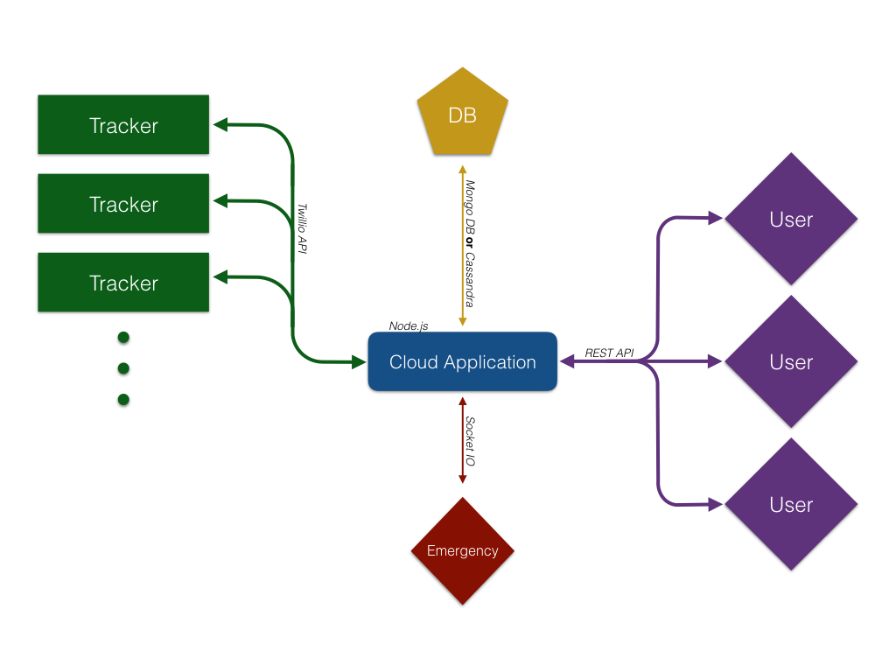
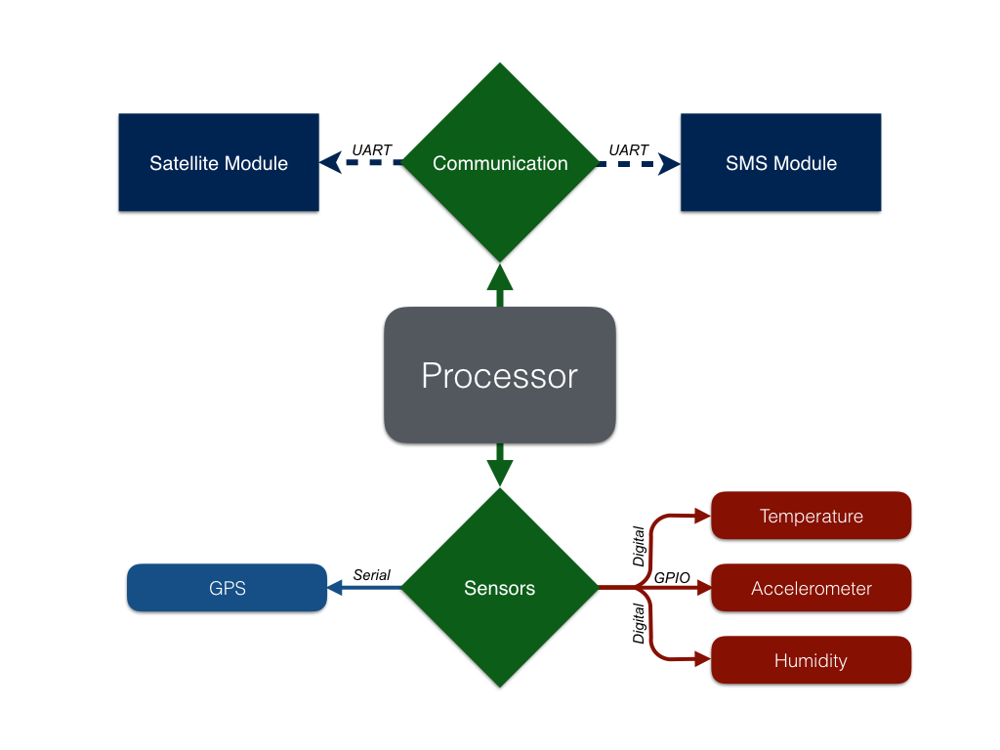

# GPS_Tracker
A GPS tracker for a 3rd party logistics company. A medium article on how it came to be:  https://medium.com/abhishek-pratapa/the-gps-tracker-842071f3ebae#.iqlriwf8i

<h2>Software</h2>

The software of the tracker consisted of an Arduino sketch and a backend initially built in Node.js however we scrapped that after we didn't have the funds to pay for the twillio api access. 

<h2>Hardware</h2>

The hardware of the tracker consisted of the below components, a full listing of parts is to follow later.  

